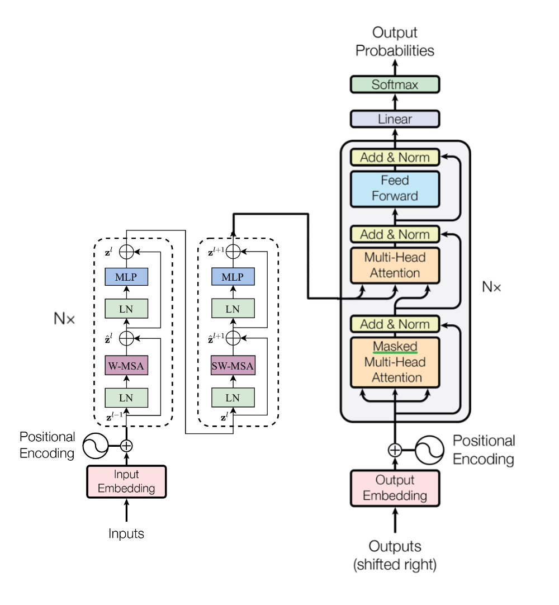
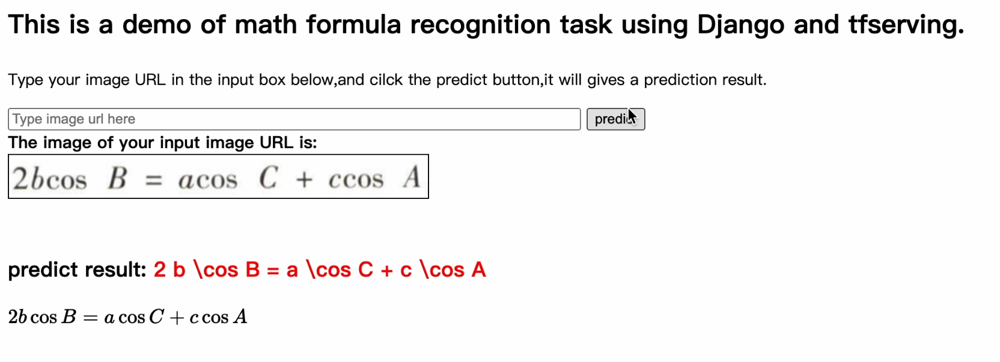

# Swin-Transformer Chinese-LaTex OCR

本项目基于Swin-Transformer实现中文和latex公式的混合识别。

## 项目概述

本项目是基于Swin-Transformer骨干网络实现的一款中文公式混合识别OCR算法，是小组参考[YongWookHa](https://github.com/YongWookHa/swin-transformer-ocr) 的实现，并根据具体任务需求理解做出改进后实现的。

本项目得益于[timm](https://github.com/rwightman/pytorch-image-models) and [x_transformers](https://github.com/lucidrains/x-transformers)等开源框架， 可以使我们的工作聚焦于OCR业务本身。

本项目的Demo是中文和公式的混合OCR识别，可以根据自己的情况迁移到手写体。 Demo数据由初高中数学试卷经过人工标注后通过Mathpix生成ground true标签。在测试时需要将数据高度等比缩放，宽度根据实际情况添加padding或者裁剪。 而在实际应用中可以根据自己业务需求训练更大长度的模型。



## 性能

| BLEU | Edit-DIstance | Acc  |
| ---- | ------------- | ---- |
| 0.88 | 0.97          | 0.86 |

本项目数据集数量大约7万，受限于数据量大小，模型性能受限，在大数据集上进行训练能提高模型上限。

## 代码组织结构

```bash
./swin-transformer-ocr/
├─ checkpoint/   训练生成的模型权重文件
├─ data-preprocess 数据处理参考代码
│  ├─ ...
├─ dataset/   存放处理好的数据集
│  ├─ images
│  ├─ train.txt
│  ├─ val.txt
│  ├─ vocab.pkl
│  ├─ vocab.txt
├─ settings  存放的是模型配置文件
│  ├─ test.yaml
├─ run.py
└─ ...
```

## 使用方法

### 环境配置

1.先创建ssh连接密钥，然后克隆仓库。

```
git clone https://github.com/Fangziyang0910/Swin-Transformer-Chinese-LaTex-OCR.git
```

2.创建一个conda环境

```
conda create -n latex_ocr python=3.8
conda activate latex_ocr
```

3.进入并安装pytorch以及对应的依赖,pytorch请安装自己对应的pytorch版本

pytorch网址：https://pytorch.org/get-started/previous-versions/
安装pytorch,这个版本请改成自己的，并在安装后检查版本

```
pip install torch==2.1.0 torchvision==0.16.0 torchaudio==2.1.0 --index-url https://download.pytorch.org/whl/cu118
```

4.安装依赖

```
cd Swin-Transformer-Chinese-LaTex-OCR/swin-transformer-ocr
pip install -r requirments.txt
```

### 放入数据集

1.将数据集自己放进来，放在swin..这个目录下,然后运行一次built-dataset.py(新的数据集进来要改路径)。有点慢请耐心等待，处理好的数据将会放在dataset文件夹中。

```
python build-dataset.py --oldpath datasets_no_test --newpath dataset
```

2.运行resize.py。在dataset中得到resized_images文件夹，用该文件夹作为图像文件夹参数传入

```
python resize.py --path dataset --target_ratio 2 --target_width 448
```

### 开始训练

推荐使用默认的default.yaml,然后在尝试自己调整模型参数

```
python run.py --batch_size==16 --setting settings/default.yaml --version 0
```

使用tensorboard监控训练情况，本项目数据量约7万，batch_size==64, 在3张3090显卡上训练50个epoch用时5h，可作为参考。

```
tensorboard --log_dir tb_logs --bind_all
```


### 推理

```python
python predict.py --setting <your_setting.yaml> --target <image_or_directory> --tokenizer <your_tokenizer_pkl> --checkpoint <saved_checkpoint>
```


## 部分代码说明

#### build_dataset.py

用于得到train.txt：将原本存储在上万个文件中的labels合并成一个文件

使用方法：

```
python new-build-dataset.py --oldpath <oldpath> --newpath <newpath>
```

#### dataset.py

##### CustomDataset

用于导入vocab.txt以建立token表，vocab.txt的存储路径于settings/test.yaml中的txt_dict, 需要根据自己的存放位置进行修改test.yaml

需要修改 CustomCollate中的

```
alb.PadIfNeeded(min_height=224, min_width=448,border_mode=cv2.BORDER_CONSTANT,value=[255, 255, 255]),
```

将min_height和min_width与test.yaml中的height,width调整相同。

test.yaml中的image_dir需修改为使用resize.py处理后的（调整尺寸后的）数据集，路径如: "dataset/resized_images"

##### CustomCollate

用于对一个批次的样本数据进行数据增强，其调用返回的是一个批次的(images,labels)，images/labels是一个列表

##### Tokenizer

包含了一些方法用于文本处理和编码解码操作

## 实现细节

1. 用FMM实现分词

2. 对图像按比例进行resize，padding成一个2：1长方形

3. 数据增强

4. 使用beam_search束搜索预测输出序列，避免贪心搜索陷入局部最优解的问题

5. 使用django框架实现前后端

    


## 模型调优经验


|  mode  | dimension |       stratege        | SwinT-Block | avg-score |
| :----: | :-------: | :-------------------: | :---------: | :-------: |
|  Base  |  96-384   |           /           |   [2,6,2]   |   90.09   |
| Model1 |  192-768  |           /           |      -      | **91.15** |
| Model2 |  192-768  | at_on_at&rel_pos_bias |      -      |   90.18   |
| Model3 |  92-768   |           /           |  [2,2,6,2]  |   90.90   |
| Model4 |  96-384   |      Beam-Search      |      -      |   90.28   |


